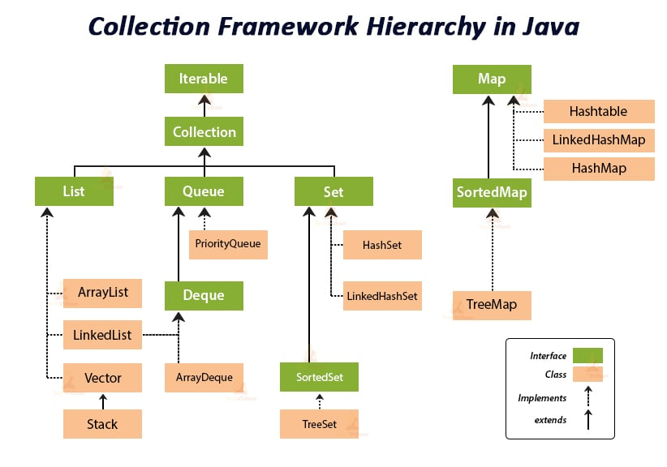

# Learning-Collection-Framework
Java-Collection-Framework" is GitHub repository for a comprehensive and beginner-friendly exploration of Java's Collections Framework.  this repository simplifies the understanding and utilization of collections Covering essential data structures like lists, sets, maps, and queues. If you have information to share, please feel free to contribute.
# java collection framework 🚀💫
## Introduction
- This repository is dedicated to the Java Collection Framework, a fundamental part of Java's core libraries.
- The Collection Framework provides a set of data structures and algorithms for storing, manipulating, and processing data efficiently.

## Hierarchy of Collection Framework in Java 🚀

 
<a href="https://data-flair.training/blogs/collection-framework-in-java/">Hierarchy of Collection Framework in Java </a>

## Method summary 🚀

 
<a href="https://docs.oracle.com/en/java/javase/17/docs/api/java.base/java/util/Collection.html">Method Sumary Collection Interface</a>

## Contents
- **Lists**: Learn about ArrayList, LinkedList, and Vector. Understand when to use each type of list.
- **Sets**: Explore HashSet, LinkedHashSet, TreeSet, and learn about unique elements and their uses.
- **Maps**: Dive into HashMap, TreeMap, and LinkedHashMap, and understand key-value pairs.
- **Queues**: Study PriorityQueue, LinkedList, and ArrayDeque, and their applications.
- **Interfaces**: Discover Collection, List, Set, Map, Queue, and their methods.
- **Utility Classes**: Explore Collections and Arrays utility classes.
- **& so on...**

## Contributions
- Feel free to contribute by adding more examples, fixing errors, or enhancing explanations.
- Contribute with us to make this repository even more informative and beneficial for everyone. Your participation is valued and welcome!.

## Feedback
- If you find issues, have suggestions, please create an issue.
- Your valuable feedback and contributions help in enhancing this repo.

## Enjoy Learning!
